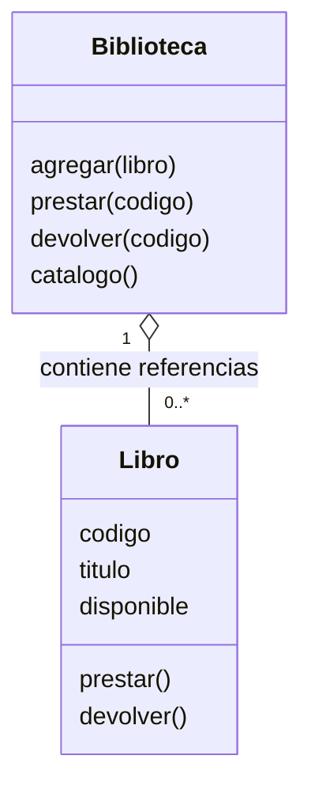
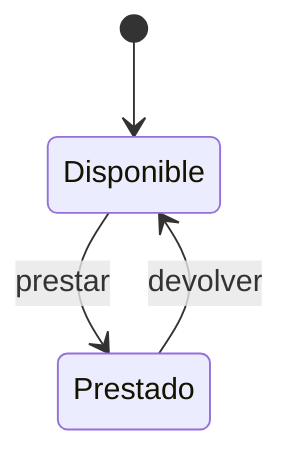

# Proyecto 02 · Biblioteca del aula

**Problema:** controlar disponibilidad de ejemplares sin duplicar préstamos. No registra personas. Los datos están en memoria y se reinician al salir; la persistencia se aprende en el siguiente proyecto.

```bash
python proyectos/02_biblioteca/main.py
```

Desde la raíz, elige 1 para listar; 2 y L1 para prestar; repite para ver el rechazo; 3 y L1 para devolver; 0 para salir.

## Modelo



La relación del diagrama es agregación: los objetos Libro se crean externamente y la biblioteca conserva sus referencias. Usamos colaboración entre objetos sin imponer propiedad exclusiva de su ciclo de vida.



Prestar desde Prestado y devolver desde Disponible se rechazan, conservando el estado.

## Hitos

1. Módulo 03: reglas, CRC y estados en papel.
2. Módulos 04–05: Libro y protección de sus cambios.
3. Módulo 06: Biblioteca localiza y delega; interfaz llama al dominio.

## Aceptación

| ID | Caso | Resultado |
|---|---|---|
| BIB-01 | Dos ejemplares con mismo título y códigos diferentes | Estados independientes |
| BIB-02 | Agregar un código ya existente | Rechazo sin reemplazar el anterior |
| BIB-03 | Prestar disponible | Cambia a prestado |
| BIB-04 | Prestar dos veces | Segundo préstamo rechazado |
| BIB-05 | Devolver prestado / devolver disponible | Éxito / rechazo |
| BIB-06 | Código inexistente | Error sin modificar catálogo |

## Taller

Agrega búsqueda por parte del título y listado de disponibles. Define comparación de mayúsculas y prueba cero coincidencias y varias coincidencias. Después diseña, sin implementarlo aún, un límite de préstamos por persona usando identificadores ficticios: explica por qué esa regla necesita nueva información y dónde viviría.

Sustentación: ¿por qué Biblioteca delega prestar? ¿Qué rompe asignar directamente disponible? ¿Qué diferencia hay entre igualdad de título e identidad de ejemplar?
